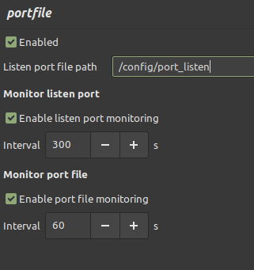

# Deluge portfile plugin

Deluge plugin to dynamically change ports based on file contents change. It is intended to be used to change listen port with scripts (eg. for VPN port-forwarding like Proton VPN). File can be monitored periodically or it can be checked when listening port is blocked by firewall (or both).




## Plugin development

```bash
# Setup virtual environment
python -m venv .venv

# Activate virtual environment
source .venv/bin/activate

# Install requirements
sudo apt-get install libcairo2-dev libgirepository1.0-dev glade
pip install deluge pygobject pycairo

# Edit UI
glade

# Setup Deluge environment
sudo docker pull lscr.io/linuxserver/deluge:latest
sudo docker create -p 8112:8112 -p 58846:58846 -e DELUGE_LOGLEVEL=debug --name=deluge lscr.io/linuxserver/deluge:latest
sudo docker start deluge
sudo docker exec -it deluge bash
cd /config
apk add nano
nano auth # Add test:test:10
# In WebUI check Daemon -> Allow remote connections
exit
sudo docker restart deluge
sudo docker logs --follow deluge | grep portfile # Check Deluge logs

# Build plugin
python setup.py bdist_egg
```
